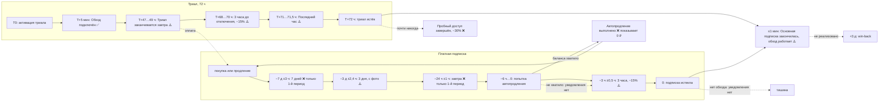
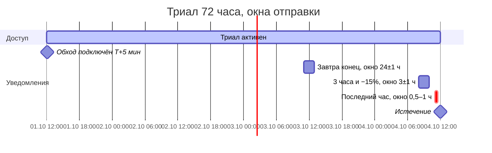
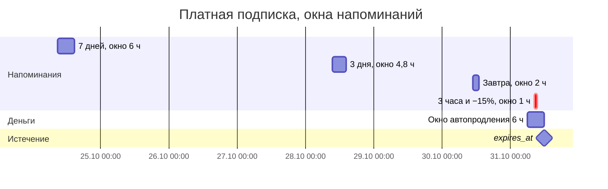

# Автоматические уведомления пользователям: инвентаризация и аудит

| | |
|---|---|
| Дата | 2026-09-13 |
| База | ветка `refactor/audit-2026-09`, коммит `eac672ba` |
| Режим | только чтение и документация, прод-код не менялся |
| Что внутри | все уведомления, которые бот шлёт **сам** (по таймеру, по состоянию или по вебхуку), а не в ответ на действие пользователя |

## Как читать

- **Сводная таблица** ниже — одна строка на уведомление. Колонка «Карточка» ведёт на подробный разбор в [`cards/`](cards/).
- **[bugs-and-risks.md](bugs-and-risks.md)** — все баги и риски, от критичных к минорным, со сценарием воспроизведения и `file:line`.
- **[recommendations.md](recommendations.md)** — что улучшить: приоритет P0/P1/P2, обоснование, оценка трудозатрат.
- **[admin-alerts.md](admin-alerts.md)** — короткий список автоматических алертов **админу**.
- Статусы: ✅ корректно · ⚠️ есть риск (теряется или дублируется в отдельных сценариях) · ❌ баг (воспроизводится на обычном пути).
- Все ссылки вида `reminders.py:292` даны относительно корня репозитория на коммите `eac672ba`.

## Кто отправляет (воркеры)

Все воркеры — `asyncio.create_task` в одном процессе (`main.py`). Единственность инстанса в PROD обеспечивает advisory lock Postgres (`main.py:218-235`).

| Воркер | Файл | Период | Старт | Что шлёт |
|---|---|---|---|---|
| reminders | `reminders.py:323-384` | 45 мин + длительность итерации (таймаут 120 с) | `main.py:245` | напоминания платным и по админ-выдаче |
| trial_notifications | `trial_notifications.py:874-995` | 5 мин (таймаут 120 с) | `main.py:254` | вся триальная воронка + завершение триала |
| bypass fast-task | `app/services/trials/bypass_activation_delay.py:36-59` | разовый, через 300 с после активации триала | `app/handlers/callbacks/subscription.py:265-269` | «Обход подключён» |
| fast_expiry_cleanup | `fast_expiry_cleanup.py:51-433` | 60 с (env 60–300) | `main.py:473` | «Основная подписка закончилась, обход работает» |
| auto_renewal | `auto_renewal.py:484-610` | 10 мин (env 5–15) | `main.py:483` | «Подписка автоматически продлена» |
| activation_worker | `activation_worker.py:371-500` | 5 мин | `main.py:498` | «Подписка активирована!» |
| traffic_monitor | `app/workers/traffic_monitor.py:122-140` | 5 мин + 0,2 с на пользователя | `main.py:272` | пороги остатка трафика обхода |
| Platega webhook | `platega_service.py:726` и далее | по событию | HTTP | статусы СБП-подписки и списания |

Тексты части уведомлений можно менять из дашборда (реестр `app/services/automated_notifications/registry.py`, таблица из миграции `068`). **Оверрайд только русский**, и сейчас он уходит и EN-пользователям тоже — см. [N-03](bugs-and-risks.md#n-03).

## Сводная таблица

| Сегмент | Уведомление | Когда | Воркер | Дедупликация | Статус | Карточка |
|---|---|---|---|---|---|---|
| Триал | Обход белых списков подключён | T+5 мин после активации | fast-task, запасной путь — trial_notifications | `trial_notif_bypass_activated_sent`, захват **до** отправки | ✅ | [trial-bypass-activated](cards/trial-bypass-activated.md) |
| Триал | Пробный период заканчивается завтра | за 24 ч ±1 ч до `trial_expires_at` | trial_notifications (5 мин) | `trial_notif_24h_sent` после отправки | ⚠️ | [trial-reminder-24h](cards/trial-reminder-24h.md) |
| Триал | 3 часа до отключения, −15% | за 3 ч ±1 ч | trial_notifications | `trial_notif_3h_sent` только при успехе | ⚠️ | [trial-reminder-3h](cards/trial-reminder-3h.md) |
| Триал | Последний час пробного доступа | за (0,5; 1] ч | trial_notifications | `trial_notif_71h_sent` | ⚠️ | [trial-last-hour](cards/trial-last-hour.md) |
| Триал → истёк | Пробный доступ завершён, −30% | 0–24 ч после конца триала | trial_notifications | `users.trial_completed_sent` до отправки | ❌ | [trial-expired](cards/trial-expired.md) |
| Платная, истекает | Подписка заканчивается через 7 дней | за 7 д ±3 ч | reminders (45 мин) | `reminder_7d_sent` — **не сбрасывается** | ❌ | [paid-reminder-7d](cards/paid-reminder-7d.md) |
| Платная, истекает | Активна ещё 3 дня (с фото) | за 3 д ±2,4 ч | reminders | `reminder_3d_sent`, сбрасывается при продлении | ⚠️ | [paid-reminder-3d](cards/paid-reminder-3d.md) |
| Платная, истекает | Подписка заканчивается завтра | за 24 ч ±1 ч | reminders | `reminder_1d_sent` — **не сбрасывается** | ❌ | [paid-reminder-1d](cards/paid-reminder-1d.md) |
| Платная, истекает | 3 часа до отключения, −15% | за 3 ч ±0,5 ч | reminders | `reminder_3h_sent`, сбрасывается | ⚠️ | [paid-reminder-3h](cards/paid-reminder-3h.md) |
| Админ-выдача 1 д | Бесплатный доступ завершается через 6 часов | за 6 ч ±0,5 ч | reminders | `reminder_6h_sent` | ⚠️ | [grant-reminder-1day-6h](cards/grant-reminder-1day-6h.md) |
| Админ-выдача 7 д | Бесплатный доступ истекает через 24 часа | за 24 ч ±1 ч | reminders | `reminder_24h_sent` | ❌ | [grant-reminder-7days-24h](cards/grant-reminder-7days-24h.md) |
| Истекла (есть обход) | Основная подписка закончилась, обход работает | ≤1 мин после `expires_at` | fast_expiry_cleanup (60 с) или trial_notifications | переход состояния (`source='bypass_only'`), флага нет | ⚠️ | [expired-bypass-active](cards/expired-bypass-active.md) |
| Платная | Подписка автоматически продлена | в окне 6 ч до конца, если хватает баланса | auto_renewal (10 мин) | `payments.notification_sent` | ❌ | [paid-auto-renewal-success](cards/paid-auto-renewal-success.md) |
| Платная | Подписка активирована! | после отложенной активации | activation_worker (5 мин) | переход `activation_status` | ⚠️ | [paid-activation-success](cards/paid-activation-success.md) |
| Платная, СБП-рекуррент | 6 сообщений Platega (активирована, списание прошло или не прошло, отменена…) | вебхук Platega | webhook | `charge_id` для списаний, для статусов нет | ⚠️ | [paid-platega-recurring](cards/paid-platega-recurring.md) |
| Трафик обхода | Осталось 8 / 5 / 3 / 1 ГБ / 500 МБ / закончился | остаток ≤ порога | traffic_monitor (5 мин) | `users.traffic_notified_*` | ⚠️ | [traffic-thresholds](cards/traffic-thresholds.md) |
| — | Мёртвые ключи реестра и i18n | никогда не отправляются | — | — | ⚠️ | [other-dead-registry-keys](cards/other-dead-registry-keys.md) |

Итого: **16 живых карточек** (21 разный текст, если считать 6 порогов трафика и 6 сообщений Platega по отдельности) и одна карточка мёртвых ключей.

## Жизненный цикл: что и когда приходит

### Триал крупным планом (пример: активация 1 октября, 12:00 UTC)

### Последние 8 дней платной подписки (пример: истекает 31 октября, 12:00 UTC)

Воркер reminders тикает раз в ~45–48 мин, поэтому в окно «3 часа» (1 ч) попадает **ровно один тик**, в окно «завтра» — два ([N-10](bugs-and-risks.md#n-10)).

## Чего нет совсем

| Ситуация | Что должно приходить | Что происходит сейчас | Ссылка |
|---|---|---|---|
| Платная подписка истекла, у пользователя нет обхода (`remnawave_uuid IS NULL`) | «Подписка закончилась, продлите» | ничего: `status='expired'` молча (`fast_expiry_cleanup.py:308-316`) | [N-12](bugs-and-risks.md#n-12) |
| Автопродление не прошло — не хватило баланса | «Не хватило N ₽, пополните баланс» | ничего, только debug-лог (`auto_renewal.py:361-362`); после пополнения повторной попытки нет | [N-12](bugs-and-risks.md#n-12) |
| Прошло 3–7 дней после истечения | win-back с оффером | не реализовано (воркера нет) | [N-12](bugs-and-risks.md#n-12) |
| Пользователь один раз заблокировал бота, потом вернулся | снова получать уведомления | `is_reachable` не восстанавливается: напоминаний и автопродления больше не будет | [N-02](bugs-and-risks.md#n-02) |

## Главное (топ-7)

1. ❌ [N-01](bugs-and-risks.md#n-01) — напоминания «7 дней» и «завтра» приходят только в **первом** платном периоде: флаги не сбрасываются ни при продлении, ни при новой покупке.
2. ❌ [N-02](bugs-and-risks.md#n-02) — `is_reachable=FALSE` навсегда. Один Forbidden или «chat not found» — и больше нет ни напоминаний, ни **автопродления с баланса**.
3. ❌ [N-03](bugs-and-risks.md#n-03) — EN-пользователи получают русские тексты напоминаний: из-за оверрайда реестра i18n-фолбэк недостижим.
4. ❌ [N-04](bugs-and-risks.md#n-04) — после админ-выдачи, промо-ссылки или бонуса `admin_grant_days` «прилипает». Платящий пользователь получает «бесплатный доступ истекает» или не получает напоминаний вовсе.
5. ❌ [N-05](bugs-and-risks.md#n-05) — «Пробный доступ завершён, −30%» почти не доходит (гонка с fast_expiry_cleanup), а скидка 30% в коде не применяется.
6. ❌ [N-06](bugs-and-risks.md#n-06) — уведомление об автопродлении пишет «Списано с баланса: 0.00 ₽».
7. ❌ [N-07](bugs-and-risks.md#n-07) — кнопка рассылки «🎁 Получить пробный ключ» переводит платного пользователя в `source='trial'`, и напоминания отключаются до конца периода.

## Вне фокуса (событийные, в ответ на действие пользователя или платёж)

Не разбирались карточками, перечислены для полноты:

| Что | Где |
|---|---|
| Оплата прошла: приветствие или продление (ключи реестра `payment.*` используются на пути баланса `app/handlers/callbacks/payments_callbacks.py:794-808`; на пути вебхуков тексты в коде) | `app/services/payments/confirmation.py:669,703,1032` |
| Кэшбэк рефереру, «друг зарегистрировался», «друг взял триал» (рандомные шаблоны) | `app/handlers/notifications.py:26`, `app/handlers/user/start.py:378-379`, `app/handlers/callbacks/subscription.py:75-76`, `app/services/notifications/loyalty_pushes.py` |
| WATA: оплата отклонена | `wata_service.py:620-640` |
| Ферма: созрело, 12 ч до гниения, сгнило, шторм | `app/workers/farm_notifications.py:35-254` (30 мин) |
| Отложенные и повторяющиеся рассылки админа | `app/services/scheduled_broadcasts_worker.py` (1 мин), риски — `docs/audit/00_recon.md` §5 |
