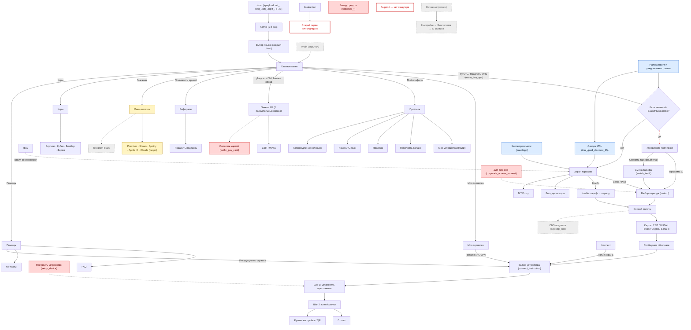

# Карта экранов бота: что используется, а что нет

- **Дата:** 2026-09-13
- **База:** `refactor/audit-2026-09` @ `fe4f1efc`. Прод-код идентичен `origin/main` `cf8205fc`, плюс коммиты чистки B2–B5 и платёжного ядра за флагом. Git-даты во всех таблицах взяты **с прода** (`git blame cf8205fc`).
- **Режим:** только анализ. Код не менялся, добавлены только файлы в `docs/screens/`.
- **Рамки:** `docs/audit/SCOPE.md`. Магазин 🔒 только описан, не трогаем. Сироты из пакета B3 (`docs/audit/01_dead_code.md`) уже удалены. Здесь найдены **новые**.

## Файлы

| Файл | Что внутри |
|---|---|
| [inventory.md](inventory.md) | Таблица **всех 460 хэндлеров** по разделам: экран, callback/команда, файл:строка, откуда достижим, статус, последний коммит |
| [candidates.md](candidates.md) | Кандидаты на удаление и упрощение: доказательство, риск, что сломается, сколько строк уйдёт |
| [inconsistencies.md](inconsistencies.md) | **Одно намерение — разные экраны** (`/buy` против «Купить/Продлить VPN» и др.), тупики, FSM-ловушки, игры |
| [dead_i18n.md](dead_i18n.md) | 349 ключей i18n, на которые не ссылается ни одна строка кода |
| [owner_checklist.md](owner_checklist.md) | Короткий чек-лист для владельца: «проверь в боте / используешь ли?» |

## Легенда

| Статус | Значение |
|---|---|
| ✅ | **Активный.** Достижим из главного меню, команд или обычных переходов |
| ⚙️ | Активный, но кнопка видна **только при включённом провайдере** (`platega_service`, `wata_service`, `cryptobot_service` `.is_enabled()`). Зависит от ENV прода |
| 🔗 | **Только из deep link, уведомления, рассылки или сообщения об оплате.** В меню кнопки нет |
| 🙈 | **Скрытый.** Кнопка закомментирована, видна только легаси biz-подписчикам или команда не объявлена в `set_my_commands` |
| 👻 | **Сирота.** Ни одна строка кода не производит его `callback_data`, либо вход в цепочку — сирота |
| 🛠 | **Админ** (экраны админки в боте) |
| 🔒 | **Магазин.** Защищён SCOPE.md, только описан |

## Сводка

Всего 460 функций-хэндлеров (464 регистрации `@router.*`).

| Статус | Хэндлеров | Строк кода в хэндлерах* |
|---|---:|---:|
| ✅ Активные | 120 | ≈ 9 000 |
| ⚙️ Зависят от ENV | 5 | ≈ 430 |
| 🔗 Deep link / уведомления / рассылки | 35 | ≈ 1 780 |
| 🙈 Скрытые | 12 | ≈ 300 |
| 👻 Сироты (польз.) | 13 | ≈ 470 |
| 👻🛠 Сироты (админ) | 2 | ≈ 140 |
| 🛠 Админ | 220 | ≈ 9 900 |
| 🔒 Магазин (из них 🙈 7 — ветка Stars, 👻 1 — `stars_pay:balance`) | 53 | ≈ 2 020 |

\* Строки самих функций-хэндлеров, без вспомогательных функций и клавиатур.

### Главное в одном абзаце

1. **Почти половина хэндлеров (220 из 460, ≈ 10 тыс. строк) — старая админка в боте.** С 2026-06-05 (`03ba5767`) команда `/admin` показывает только «Открыть дашборд» и «Сбросить пароль». Всё меню админки при этом осталось в коде и открывается через «чёрный ход»: кнопку «Назад» у `/promo_stats` и «← Админ-панель» в чате с пользователем. Большая часть разделов дублирует дашборд. Подробности — в [candidates.md §D](candidates.md#d-админ-экраны-дублирующие-дашборд).
2. **Найдено 16 новых сирот** (после B3): вся цепочка «Вывод средств» (8 хэндлеров), каталог «Для бизнеса», «Настроить устройство», «Оплатить картой» у пакета ГБ, дубль `noop`, массовый перевыпуск ключей в админке и `stars_pay:balance` в магазине.
3. **Баг, о котором сообщил владелец, подтверждён.** `/buy` всегда открывает экран тарифов, а «Купить VPN» / «Продлить VPN» у активного подписчика открывает «Управление подпиской». Расхождение появилось 2026-04-06 (`285f0162`): новый экран добавили только в кнопку, `/buy` не трогали с 2026-02-13. См. [inconsistencies.md §1](inconsistencies.md#1-покупка-и-продление).
4. **`/support` есть в меню команд, но хэндлера у неё нет.** Бот молча игнорирует нажатие (`main.py:559`, `Command("support")` нигде не зарегистрирован).
5. **Два разных экрана «Инструкция»:** `/instruction` открывает старый экран (`instruction._text` + гайд в mini app), а «Помощь → Инструкции» — новый выбор устройства.
6. **349 мёртвых ключей i18n** (≈ 30 % словаря).

## Карта основных пользовательских потоков

Красные узлы — сироты 👻, серые пунктирные — скрытые 🙈, жёлтые — магазин 🔒, синие — вход только из уведомлений 🔗. Пунктирная красная стрелка — расхождение точек входа.

## Как читать и как проверяли

- **Граф экранов** строился скриптом по AST. Узлы — все функции с `@<router>.callback_query/.message/.pre_checkout_query`. Рёбра — строковые `callback_data` (литералы и префиксы f-строк), сопоставленные с фильтрами `F.data == / .startswith / .in_ / lambda`. Корни: команды, `/start`, сообщения воркеров (`reminders.py`, `trial_notifications.py`, `fast_expiry_cleanup.py`, `auto_renewal.py`, `app/services/**`), кнопки рассылок из дашборда (`app/api/dashboard/routes/broadcasts.py`).
- **Живость производителя.** Кнопка засчитывается только если функция, которая её строит, хоть кем-то вызывается. Так в `common/keyboards.py` найдены мёртвые `get_profile_keyboard_old`, `get_tariff_keyboard` и другие.
- **Каждого кандидата в сироты проверяли вручную** по grep без строк `F.data` и по `git log -S'<callback>'`. Закомментированные кнопки нашёл отдельный grep `^\s*#.*callback_data=`: их две, `pay:sbp_sub` и `stars_buy`.
- **Ограничения.** Скрипт не знает ENV прода (какие провайдеры включены) и не видит старые сообщения в чатах, где кнопки ещё живы. Кнопку из старого сообщения можно нажать, даже когда в меню её уже нет. После удаления хэндлера такой клик получает общий ответ «кнопка устарела» (`app/core/unknown_message_filter.py:38`, добавлен в `e4f038c3`). Денег и доступа это не касается.
